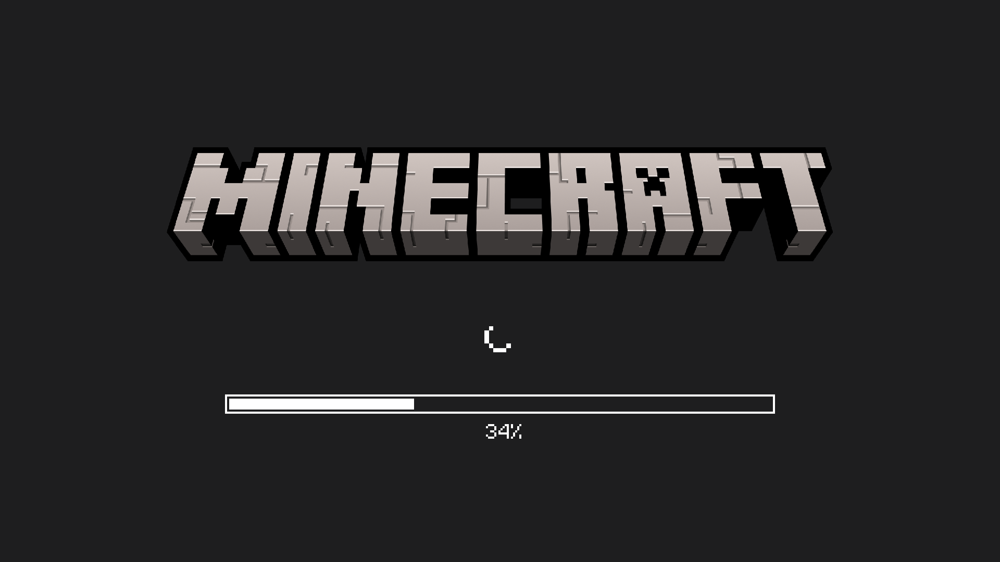
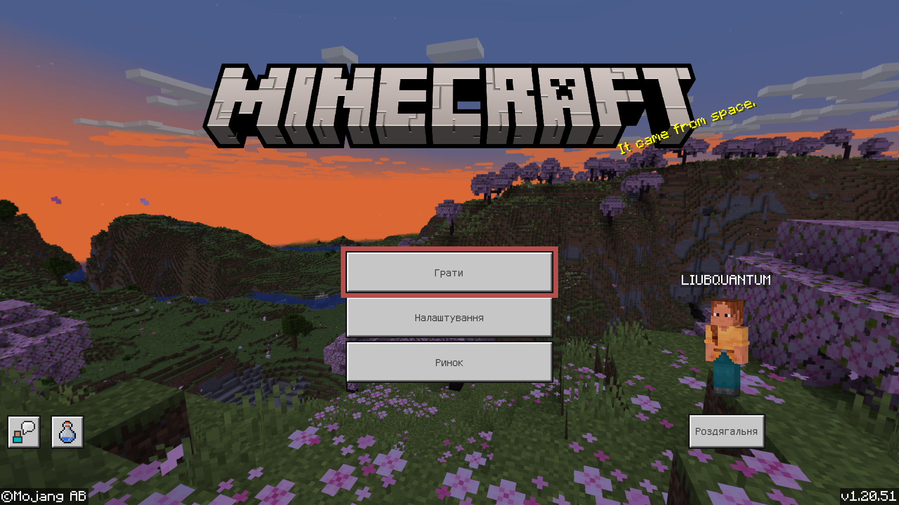

# 🎫 ┇ Як доєднатися до сервера?

## Версія клієнта

Наразі, під час `шостого` сезону сервера, він працює на версії `1.20`, тож ми рекомендуємо доєднуватися з неї, але, якщо ви вже маєте збірку на молодших версіях гри (`1.20.1`, `1.20.2` тощо), то можете спробувати доєднатися з них, сервер оснащено плагіном ViaVersion, який дозволяє це робити. Але, якщо ви зіткнетеся із проблемами з підключенням, то радимо все ж спробувати нативну версію, на якій працює сервер.

## Дані сервера

Якщо ви вже вмієте доєднуватися до Minecraft серверів, то ось вам відразу дані, якщо ж ні, то прочитайте інструкцію для вашого видання ([Java](/how-to-join#доєднання-з-java-видання) / [Bedrock](/how-to-join#доєднання-з-bedrock-видання)).

- Ім'я сервера / Назва сервера:

```
Mine Count
```

- Адреса сервера:

```
srv.mcount.fun
```

- Порт (Необов'язково на Java):

```
25570
```

## Доєднання з Java видання

### 1. Запуск гри


Виконайте запуск версії гри, сумісної із сервером, у вашому лаунчері.

### 2. Мережева гра


У головному меню натисніить на кнопку `Гра в мережі`.

### 3. Додавання сервера


Тепер потрібно додати сервер, для цього натисніть на кнопку `Додати сервер`.

### 4. Введення даних


Заповніть поля даними сервера:

- Назва сервера:

```
Mine Count
```

- Адреса сервера:

```
srv.mcount.fun
```

Перевірте правильність введених вами даних та тисніть кнопку `Готово`.

### 5. Підключення до сервера


Сервер з'явився у списку, тепер натисніть на нього двічі щоб підключитися.

## Доєднання з Bedrock видання

### 1. Запуск гри



Виконайте запуск гри.

### 2. Браузер світів



У головному меню натисніить на кнопку `Грати` аби відкрити браузер світів.

### 3. Браузер серверів


Відкрийте вкладку з браузером серверів.

### 4. Додавання сервера


Тепер потрібно додати сервер, для цього натисніть на кнопку `Додати сервер`. Вона може бути вгорі або внизу списку серверів, в залежності від вашої платформи.

### 5. Введення даних


Заповніть поля даними сервера:

- Ім'я сервера:

```
Mine Count
```

- Адреса сервера:

```
srv.mcount.fun
```

- Порт:

```
25570
```

Перевірте правильність введених вами даних та тисніть кнопку `Зберегти`.

### 6. Підключення до сервера


Тепер віднайдіть збережений сервер у списку додаткових серверів, натисніть на нього. Праворуч з'явиться кнопка `Приєднатися до сервера`, натисніть, щоб підключитися.

## Не виходить доєднатися?

Якщо у вас не виходить встановити з'єднання із сервером, то відайте [цю сторінку](./cant-join).
