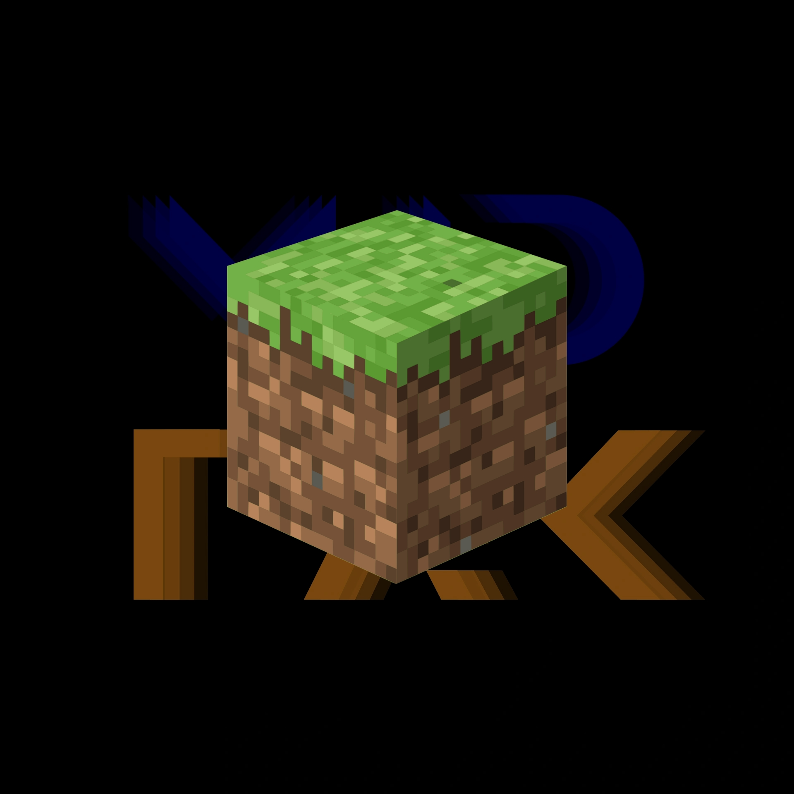
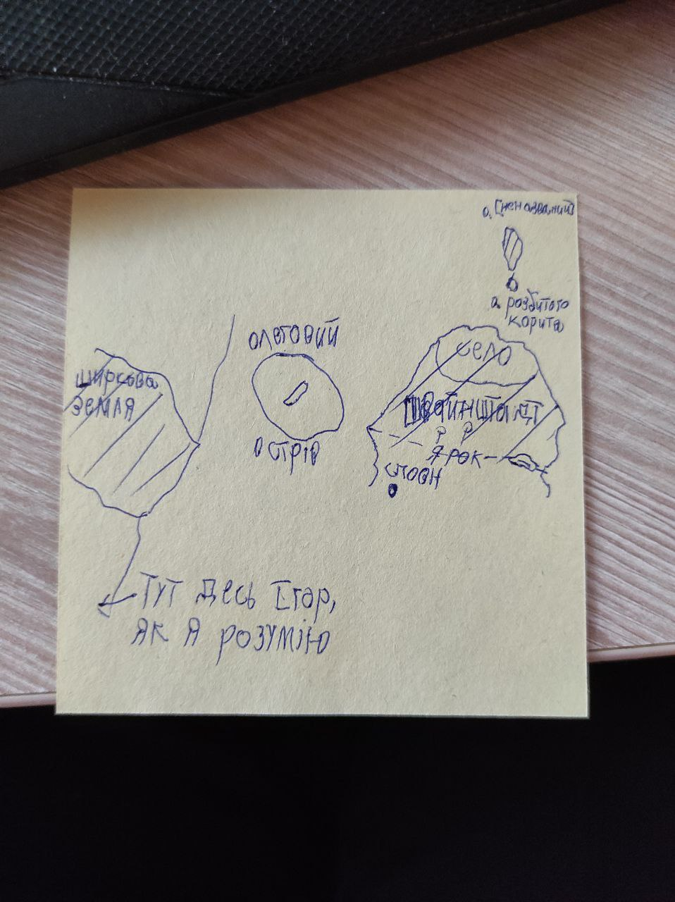

# 🥾 ┇ Сезон 1 - First Step

## 📜 ┇ Опис сезону

Запуск першого сезону сервера Mine Count (який на той час ще називався MID TAK) став відправною точкою у розвитку сервісів LIUBQUANTUM GROUP. Сталося це після знайомства liubquanti з хостингом Minecraft серверів. Точна дата запуску сезону - невідома, але це сталося приблизно у січні 2022 року.

Через деякий час, після запуску, сервер було заблоковано хостингом, через порушення правил використання. Це призвило до втрати мапи та всіх даних про сезон. Після виявлення блокування відразу було запущено новий сезон.

## 📷 ┇ Фотогалерея

>  Перший логотип сервера.

>  Фото, створене liubquanti, зі сповіщенням про блокування сервера.

>  На початку сезону гравець Sweinstadt створив намальовку з приблизним виглядом мапи сезону, з метою зображення приналежності територій гравцям.
₴