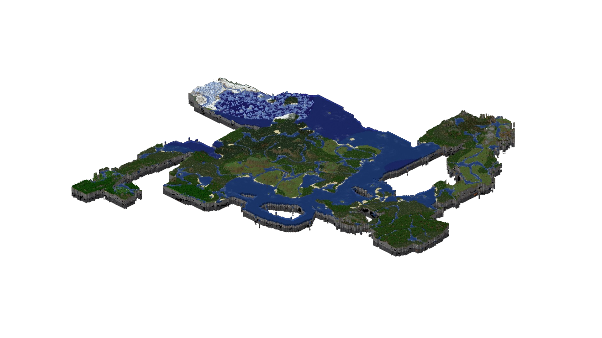
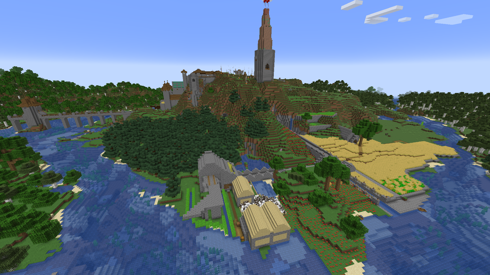
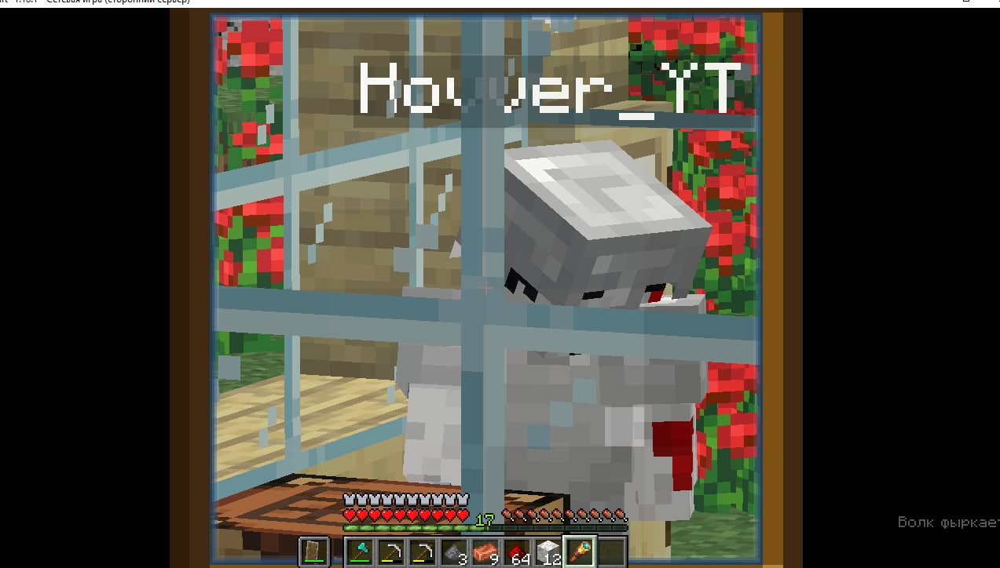
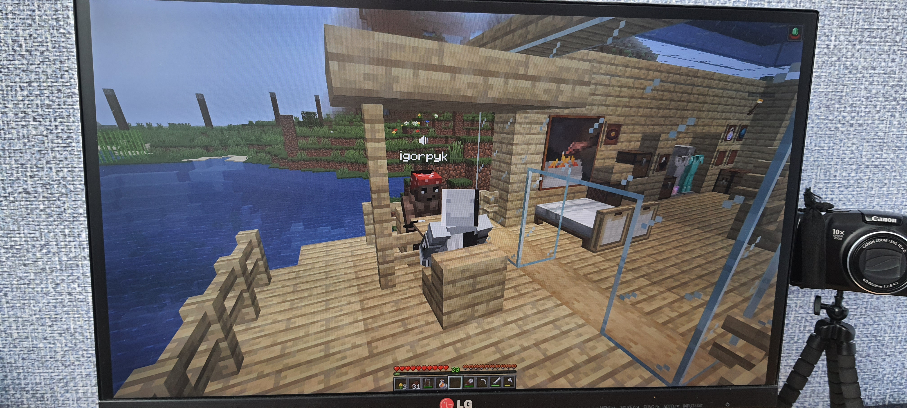
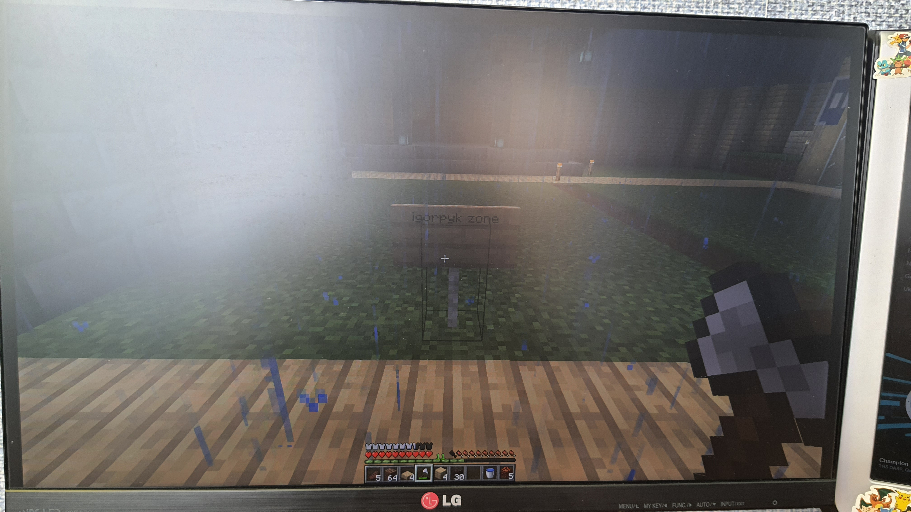
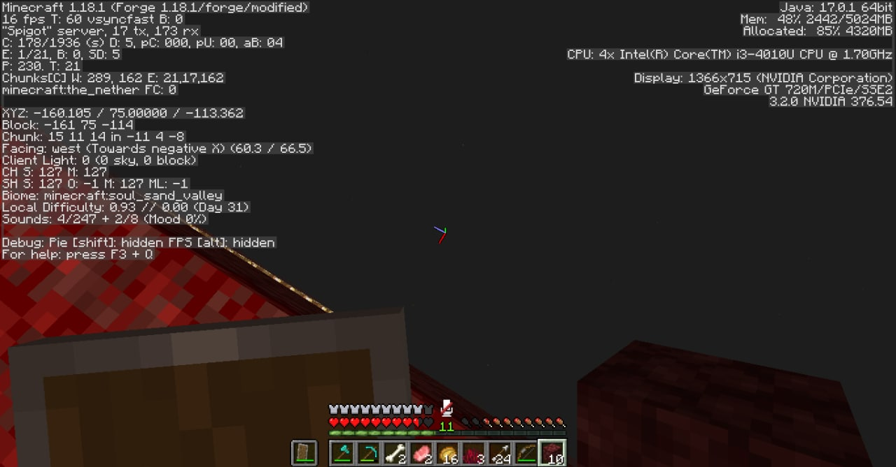

# ☀️ ┇ Сезон 2 - Total Calm

## 📜 ┇ Опис сезону

Другий сезон сервера Mine Count є одним із найвизначніших сезонів за всю історію сервера. Він відзначається неймовірною активністю та взаємодією гравців. Його було запущено після блокування сервера хостингом під час першого сезону.

## ⌛ ┇ Продовжуваність сезону

Сезон було запущено **30 січня 2022 року**, а закінчено **17 березня 2022 року**. Тобто він тривав 1 місяць, 16 днів. Не зважаючи на такий короткий період за активністю гравців його ще досі не обійшов жоден із сезонів.

## 🗺️ ┇ Мапа сезону

Мапа, яку змогли дослідити гравці за увесь сезон на основі даних DynMap. Загалом було досліджено 252 регіони та 114011 чанків.
Ви можете завантажити мапу сезону за [цим посиланням](https://sharemods.com/ivguu01kcs5i/Season_2.zip.html).

## 🏛️ ┇ Споруди

### 🏛️ ┇ Порт liubquanti - База гравця liubquanti

### 🏛️ ┇ База гравця Yangovich 

### 🏛️ ┇ Острів igorpyk - База гравця igorpyk

### 🏛️ ┇ Королівство Юлії - База гравців Hovver_YT та Yuliia

### 🏛️ ┇ Фортеця Schweineberg - База гравця Sweinstadt

## 👥 ┇ Гравці

Загалом до сервера доєдналося 15 гравців.

### ⭐ ┇ Визначні гравці

- igorpyk
- liubquanti
- Sweinstadt

### 🌐 ┇ Всі гравці

- AndDemon
- DeniPro
- DeniRus228
- Hovver_YT
- igorpyk
- liubquanti
- maxtok
- nastajw839
- redned
- Sweinstadt
- Tim_Solder
- Trollick
- Yangovich
- Yangovich1
- Yuliia

## 📷 ┇ Фотогалерея

>  igorpyk слідкує за Hovver_YT через підзорну трубу.

>  liubquanti показує підготовлену ділянку для ринкової зони.

>  Дві мапи зі шматами острова гравця igorpyk з результатом очищувальних робіт.

>  igorpyk показує підготовлені інструменти для очищувальних робіт.

>  liubquanti та igorpyk щось обговорюють на терасі будинка liubquanti.

>  igorpyk збудував портал над корінною породою.

>  liubquanti показує, що був обкрадений.

>  igorpyk зарезервував торгівельну зону.

>  igorpyk десь у нижньому світі.
