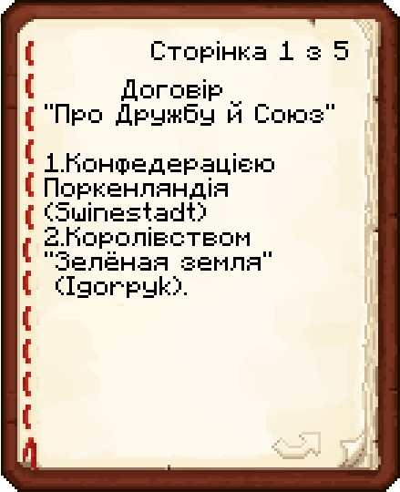
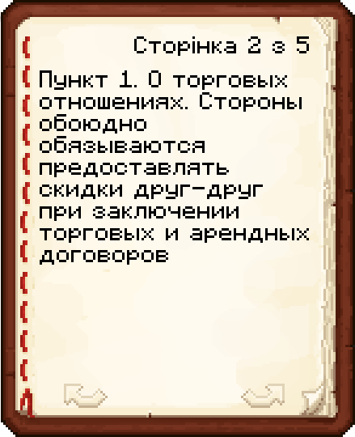
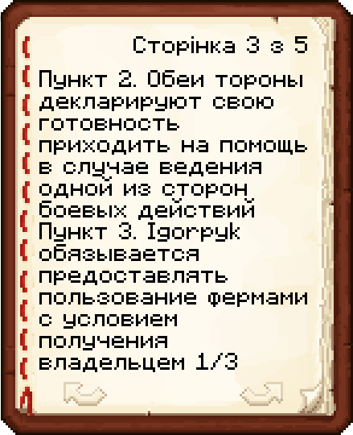
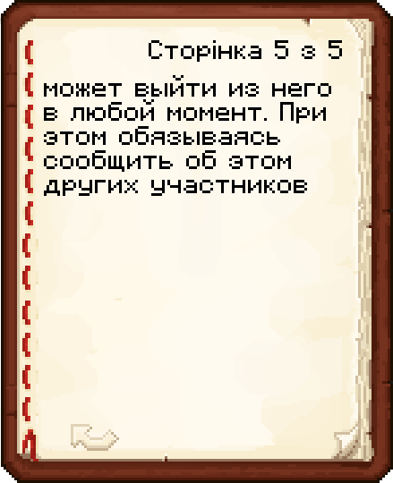
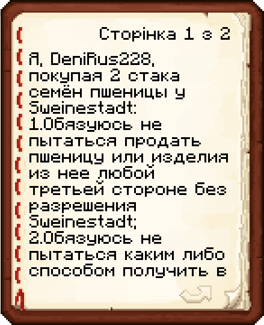
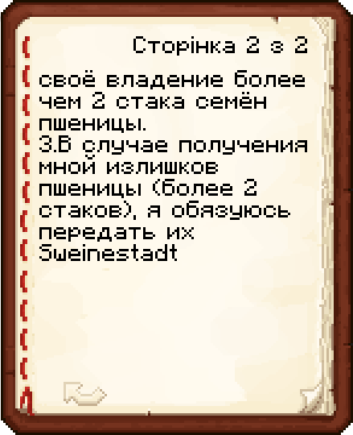
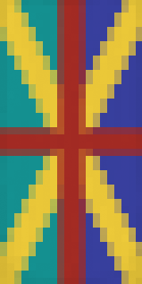

# ☀️ ┇ Сезон 2 - Total Calm

## 📜 ┇ Опис сезону

Другий сезон сервера Mine Count є одним із найвизначніших сезонів за всю історію сервера. Він відзначається неймовірною активністю та взаємодією гравців. Його було запущено після блокування сервера хостингом під час першого сезону.

## ⌛ ┇ Тривалість сезону

Сезон було запущено **30 січня 2022 року**, а закінчено - **17 березня 2022 року**. Тобто він тривав 1 місяць та 16 днів. Не зважаючи на такий короткий період за активністю гравців його ще досі не обійшов жоден із сезонів.

## 🗺️ ┇ Мапа сезону

Мапа, яку змогли дослідити гравці за увесь сезон на основі даних DynMap. Загалом було досліджено 252 регіони та 114011 чанків.
Ви можете завантажити мапу сезону за [цим посиланням](https://sharemods.com/ivguu01kcs5i/Season_2.zip.html).

## 🏛️ ┇ Споруди

### Порт liubquanti - База гравця liubquanti

Березовий порт [liubquanti](/players/liubquanti) є найпершою спорудою на сервері. Він має залізничну комунікацію зі спавном та [Королівством Юлії](/past-seasons/total-calm#королівство-юлії---база-гравців-hovver_yt-та-yuliia), торговельну зону, в якій знаходяться магазини різних гравців, хаб для вагонеток, пристань для човнів, посадковий майданчик, ферму меду та склад. Також в порту розташувався будинок гравця [liubquanti](/players/liubquanti).

### База гравця Yangovich

База гравця Yangovich - невелика споруда, яка має на своїй території поле пшениці, потаємний склад, невідомий механізм (за здогадками [liubquanti](/players/liubquanti), механізм нагадує автоматичну риболовлю) та будинок.

### Зелёная земля - База гравця igorpyk

Острів гравця igorpyk є островом зі штучно створеним ландшафтом, методом великих очіщувальних робіт. На собі вміщує шалкерний склад, потаємну ферму заліза та будинок з різними декораціями.

### Королівство Юлії - База гравців Hovver_YT та Yuliia

Королівство Юлії - територія, яка вміщає на собі поля пшениці, шахту, пристань, будинок та залізничну станцію для сполучення з [портом](/past-seasons/total-calm#порт-liubquanti---база-гравця-liubquanti).

### Фортеця Schweineberg - База гравця Sweinstadt

Фортеця Schweineberg є найбільшою та найцікавішою спорудою сезону. Її повний функціонал - достоменно невідомий: приміщення фортеці здебільшого розташовані під землею з доволі заплутаними коридорами. Серед відомого: ферма коров та овець, пристань, склад, кімната переговорів, поле пшениці, зброярня та бібліотека.

### Шахта Trollick - База гравця Trollick

Шахта Trollick - невеличка шахта поряд із селом, яке належить гравцю Trollick.

## 📄 ┇ Документи

### "Договор о о сюзе"

Підписано гравцем igorpyk.

|  |  |  |
| -------------------------------------------------- | -------------------------------------------------- | -------------------------------------------------- |
|  |  |                                                    |

### "Кредит 15.03.22"

Підписано гравцем Trollick.

|  |  |
| -------------------------------------------------- | -------------------------------------------------- |

### "Договор о покупке-продаже зерна"

Підписано гравцем DeniRus228.

|  |  |
| -------------------------------------------------- | -------------------------------------------------- |

## 🛡️ ┇ Коаліції

|        Назва        |                      Стяг                      | Склад                                 | Штаб                                                                                                            | Інформація                                                                                                                                                                                                                                           |
| :----------------------: | :------------------------------------------------: | ------------------------------------------ | ------------------------------------------------------------------------------------------------------------------- | -------------------------------------------------------------------------------------------------------------------------------------------------------------------------------------------------------------------------------------------------------------- |
|       LIUBQUANTUM       |  | [liubquanti](/players/liubquanti)             | [Порт liubquanti](/past-seasons/total-calm#порт-liubquanti---база-гравця-liubquanti)                 | Про діяльність коаліції мало що можна сказати, вона майже ніяк не показала себе на сервері. Єдиним була оргацізація торгової зони в потрту. |
| Поркенляндія |  | Sweinstadt DeniRus228 Tim_Solder | [Фортеця Schweineberg](/past-seasons/total-calm#фортеця-schweineberg---база-гравця-sweinstadt) | Планами коаліції було встановлення контролю над сервером методом вербування новачків та дипломатичних угод з розвиненими гравцями.           |

## 👥 ┇ Гравці

Загалом до сервера доєдналося 13 гравців.

### Визначні гравці

- igorpyk
- [liubquanti](/players/liubquanti)
- Sweinstadt

### Всі гравці

- AndDemon
- DeniRus228
- Hovver_YT
- igorpyk
- [liubquanti](/players/liubquanti)
- maxtok
- nastajw839
- redned
- Sweinstadt
- Tim_Solder
- Trollick
- Yangovich
- Yuliia

## 📷 ┇ Фотогалерея

>  igorpyk слідкує за Hovver_YT через підзорну трубу.

>  [liubquanti](/players/liubquanti) показує підготовлену ділянку для ринкової зони.

>  Дві мапи зі шматами острова гравця igorpyk з результатом очищувальних робіт.

>  igorpyk показує підготовлені інструменти для очищувальних робіт.

>  [liubquanti](/players/liubquanti) та igorpyk щось обговорюють на терасі будинка [liubquanti](/players/liubquanti).

>  igorpyk збудував портал над корінною породою.

>  [liubquanti](/players/liubquanti) показує, що був обкрадений.

>  igorpyk зарезервував торгівельну зону.

>  igorpyk десь у нижньому світі.
