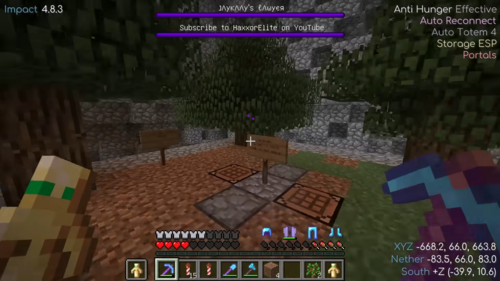
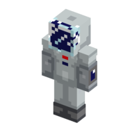
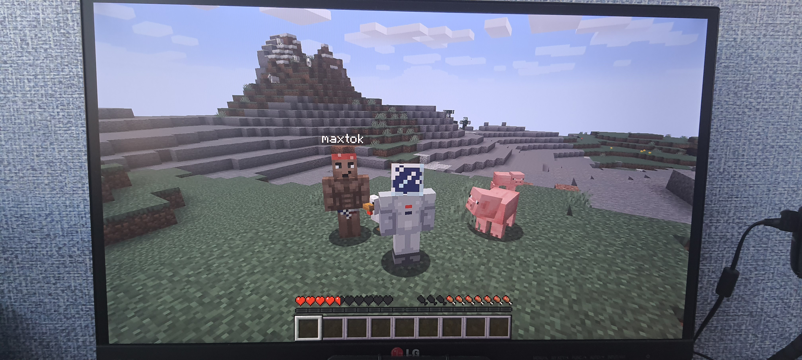
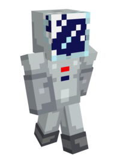

# 🤍 ┇ liubquanti

> *"У мене є мрія: створити широку мережу ігрових серверів, аби забезпечити всіх швидкою можливістю мультиплеєрної гри з друзями, без потреби розбиратися у хостингу серверів, і просто насолоджуватися грою..."* - **liubquanti**

## ⭐ ┇ Роль на сервері

liubquanti - засновник, власник та оператор сервера Mine Count. На сервері відіграє роль як оператора, виконуючи всю роботу з обслуговування сервера, так і звичайного гравця, граючи та розвиваючись, як і інші.

|  |  |
| -------------------------------------------------- | -------------------------------------------------- |
| Сучасний вигляд liubquanti           | Іконка liubquanti в меню TAB.           |

## 🛠️┇ Діяльність

### 🥾 ┇ Сезон 1 - First Step

Під час першого сезону сервера Mine Count liubquanti більше спостерігав за сервером та його роботою, аніж грав, хоча і мав невеличкий будинок-базу на острові, неподалік від спавну. Як власник та оператор сервера, він постійно пояснював гравцям механіки віддаленої гри та налаштуванням клієнтів.

Саме liubquanti ввів систему утримання сервера в онлайні 24/7, який знаходився на безкоштовному хостингу, що в результаті привело до блокування сервера, та втрати всіх даних.

### ☀️ ┇ Сезон 2 - Total Calm

На другому сезоні liubquanti знову розташувався на острові, на невеликій відстані від спавну. В результаті побудував на ньому [березовий порт](/past-seasons/total-calm#порт-liubquanti---база-гравця-liubquanti), в якому і прожив до кінця сезону. Взяв участь в облаштуванні спавну та ініціював створення єдиної мапи сервера. Також провів залізничну колію від порту до спавну, аби новачки могли швидко дістатися найближчої бази.

Також, разом з гравцем Hovver_YT побудував залізничне сполучення між портом та [Королівством Юлії](/past-seasons/total-calm#%EF%B8%8F--королівство-юлії---база-гравців-hovver_yt-та-yuliia) з метою доставлення їжі до порту без участі людини. Під час будування було створено легендарний мем з дубом, який стоїть всього на одному блоці землі та висить у повітрі.

Також liubquanti допоміг побудувати гравцю igorpyk ферму заліза на [острові останнього](/past-seasons/total-calm#%EF%B8%8F--острів-igorpyk---база-гравця-igorpyk), методом доставлення селянинів на човнах.

### 🌊 ┇ Сезон 3 - Warm Ocean

На третьому сезоні liubquanti не відрізнився сильною грою, спочатку він поселився на березі моря неподалік від спавну, в савані, та побудував там маленький будиночок, пізніше, зруйнував його, та переніс речі до новоствореної скляної бази під водою, яка знаходилася на дні того ж моря. А пізніше взагалі переїхав на базу гравця Sweinstadt, побудувавши там невеликий будинок з акації.

### ⭐ ┇ Сезон 4 - To The Pole

Четвертий сезон також вийшов для liubquanti доволі мізерний на активність. Спочатку він поселився на березі річки, в савані, збудувавши там будинок середнього розміру. Пізніше зніс його, зоставивши табличку з надписом "liubquanti переїхав на секретний пункт базування".

Назва носить доволі цікавий сенс, liubquanti надихнувся назвою спеціального кланового активу з гри World of Warships, який призначений для спрощення купівлі суперкораблів. Але на справді він просто закопав свої речі на маленькому острові поруч.

Під кінець сезону liubquanti взагалі вирішив переїхати ближче до бази гравця Sweinstadt, та зупинився на сусідній засніженій горі, що в результаті вилилося в назву сезону. Але нічого так і не було побудовано, а якщо ви зайдете на мапу під його нік-неймом, то з'явитеся на тій самій горі, де було вирішено зостатися.

### ❄️ ┇ Сезон 5 - Infinite Winter

П'ятий сезон став справжнім випробуванням для liubquanti.

Першою проблемою запуску став пошук сумісного датапаку для введення нової системи "особливий геймплей" та створення механік сезону. Тому довелося використовувати застарілий датапак з версією сервера, яка не відповідала актуальності.

Але це було нічим у порівнянні з іншими проблемами, через які йому довелося двічі повністю анульовувати світ, та запускати сервер "з нуля".

Цього сезону liubquanti цілеспрямовано шукав безкоштовний хостинг з можливістю запуску та утримання сервера в режимі 24/7. Такі варіанти існували, але на подібні хостинги часто спрямовувалися DDoS атаки, або ж вони закривалися через неможливість фінансування проекту. Один із таких хостингів і потрапив під DDoS атаку, після чого припинив своє існування, а адміністратори втратили свої сервери. Після цього сервер було перенесено на інший хостинг та запущено з початку.

Вдруге сервер довелося перезапускати через "людську дурість". Одного разу, прогулюючись liubquanti отримав сповіщення від системи відстеження онлайну сервера, що він вже вдруге пішов у перезавантаження. liubquanti відкрив динамічну мапу та побачив там велику споруду з незериту, бедроку та маяків а, також стяг Російської Федерації. При спробі доєднатися до сервера з телефону liubquanti моментально зустрів кучу візерів та був заблокований оператором на сервері. liubquanti відразу вимкнув сервер за допомогою консолі хостингу та пішов додому.

Як виявилося, гравець Coticus (в минулому Sweinstadt) разом зі своїми друзями зайшли на сервер під нік-неймом liubquanti та, отримавши права оператора, почали чинити хаос. До цього на сервері, який дозволяє доєднуватися із неліцензійних версій гри, не було встановлено жодної логін системи і все трималося на взаємній повазі, але її було зруйновано.

Світ сервера сильно постраждав, тому було вирішено анулювати його. А після перезапуску було встановлено логін систему. Також ця ситуація призвела до сильної сварки між liubquanti та Coticus. Перший звинуватив групу в аморальній поведінці, а останній - оператора в неналежному слідкуванні за сервером. В результаті це привело до систематичних атак на сервіси LIUBQUANTUM GROUP різних характерів.

Після перезапуску liubquanti почав грати разом з гравцем ffastffox. Вони разом побудували велику базу в тайзі на немалій відстані від спавну, де і промешкали до кінця сезону.

Також liubquanti постійно допомагав новим гравцям сервера, щоб вони змогли отримати кращій старт в умовах повної зими, а також розібратися з логін системою.

## 👔┇ Скін

Сучасний скін liubquanti нагадує космонавта в скафандрі з чіткими білим та чорним окантуваннями, симетрично розділеними по вертикалі, а також малюнком голови на спині. На місці обличчя знаходиться текстура скла, через яке видно повністю синю голову.

### 🌕 ┇ xcc2

Перше покоління скіну liubquanti з'явилося разом із запуском першого сезону сервера Mine Count, адже потрібно було якось виділятися серед інших гравців. Було обрано рішення створити скін власноруч. За основу було взято скін відомого гравця сервера 2b2t, xcc2.

|                                                                                                                                                                                                              |
| :-------------------------------------------------------------------------------------------------------------------------------------------------------------------------------------------------------------------------------------------------------------: |
| На фото liubquanti під час приватної гри з гравцем nastajw839. Як можна побачити, до запуску сервера Mine Count, ним використовувався оригінальний скін xcc2. |

xcc2 сподобався liubquanti, як гравець, який намагався боротися із хаосом 2b2t, доставляючи на спавн сервера дерева, щоб новачки могли мати хоча б якийсь початок для розвитку.

|                                |
| :------------------------------------------------------------------------------: |
| Дерева, розташрвані xcc2 серед руїн спавну 2b2t. |

### 💙 ┇ Перше покоління

Перше покоління скіну liubquanti мало незначні зміни від оригіналу, у вигляді повністю перефарбованих в темний синій колір голови та дисплею на лівій руці, а також невеличкої зміни яскравості та тону індикаторів на грудях.

|                        |                    |
| :----------------------------------------------------------------------: | :------------------------------------------------------------------: |
| Перше покоління скіну liubquanti спереду. | Перше покоління скіну liubquanti ззаду. |

|                                                                                                                                                                                                                                                                                                                                                                                |
| :-------------------------------------------------------------------------------------------------------------------------------------------------------------------------------------------------------------------------------------------------------------------------------------------------------------------------------------------------------------------------------------------------------------------------------: |
| Перша зафіксована поява liubquanti в новому скіні перед початком першого сезону сервера Mine Count, 24 листопада 2021 року. Конкретно на фото відбувається тестування серверного підключення з гравцем maxtok та приготування сервера до запуску. |

### 🩵 ┇ Друге покоління

Друге покоління скіну liubquanti вже значно відрізняється характером від оригіналу: скін було симетрично поділено на дві частини по вертикалі та створено окантування з чорного та білого кольорів, відповідно до їх розташування на волоссі голови, що зображена на спині. Індикатори та екран також прийняли нове забарвнення, а голова стала менш темною.

|                        |                    |
| :-----------------------------------------------------------------------: | :------------------------------------------------------------------: |
| Друге покоління скіну liubquanti спереду. | Друге покоління скіну liubquanti ззаду. |

|                                                                                                                                                                                                        |
| :-------------------------------------------------------------------------------------------------------------------------------------------------------------------------------------------------------------------------------------------------------: |
| Перша зафіксована поява liubquanti в новому скіні другого покоління, 28 січня 2022 року. Фото було зроблено для анонсу прямого ефіру з гри Minecraft. |

### ⏳ ┇ Нині

Нині liubquanti досі використовує свій скін другого покоління, він доволі добре виділяється серед натовпу та додає індивідуальності, і liubquanti не має наміру змінювати його найближчим часом.

|  |        |        |
| :------------------------------------------------: | :-------------------------------------------------------: | :-------------------------------------------------------: |
|    Оригінальний скін xcc2.    | Перше покоління скіну liubquanti. | Друге покоління скіну liubquanti. |

## 🌐┇ В реальності

В реальному світі liubquanti - 18-ти річний хлопець, на ім'я Олег. Основний рід діяльності - UI/UX дизайнер. А як хобі - працює над розвитком сервісів LIUBQUANTUM GROUP.

|  |
| :------------------------------------------------: |
|      liubquanti в липні 2024 року.      |
