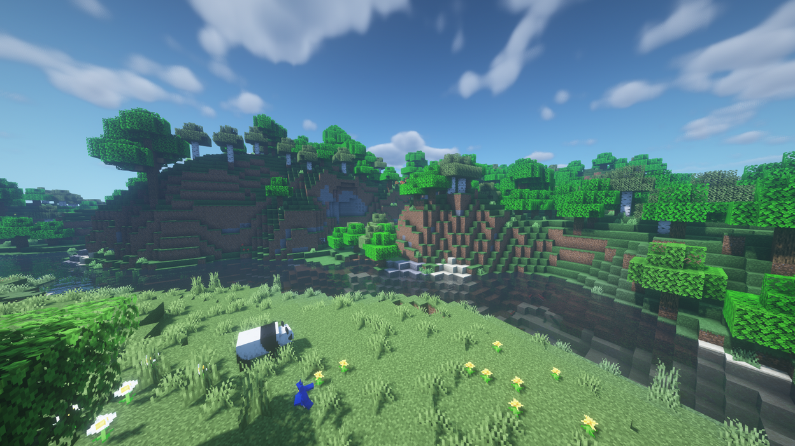

# 🍃 ┇ Пори року

Особливістю шостого сезону сервера є зміна пір року у світі, кожна пора року насичена власними фішками в механік гри. На цій сторінці детально описано кожну пору року.

## 🌱 ┇ Весна

- Весна починається 4 березня.
- Листя в лісах стає рожевим, а вода має легкий світло-блакитний відтінок.
- Вишневий цвіт починає падати з листя.
- Квіти починають рости всюди, весь світ буде схожий на квітковий ліс.
- Сніг і лід, що утворилися взимку, розтануть.
- Багато овець, корів, свиней, кроликів і курей породять по 3-5 малюків.
- Світлячки нерестяться вночі.
- Підвищується швидкість відродження бджіл.
- Температура від -10°C до 20°C, залежно від біома.
- Тривалість дня і ночі здебільшого однакова.

## ☀️ ┇ Літо

- Літо починається 4 червня.
- Дерева та трава в більшості біомів мають яскравий зелений колір, схожий на листя джунглів.
- Холодні біоми (засніжені рівнини, тайга тощо) мають трав’яний колір рівнин.
- Гарячі біоми (пустеля, савана) виглядають дещо сухими.
- Колір води і неба світло-блакитний.
- Вночі можна побачити падаючі зірки.
- Світлячки нерестяться вночі.
- Квіти, що виросли навесні, зникають.
- З дерев опадає листя.
- Всюди нерестяться плями ягідних чагарників.
- Дощ буває дуже рідко.
- Тварини, які зазвичай нерестяться в джунглях, тепер можуть нереститися всюди.
- Культури/рослини без перешкод над ними ростуть вдвічі швидше.
- Дні довгі (приблизно 13 хвилин), а ночі короткі (7 хвилин).
- Замість зомбі з'являються висушні.
- Температура від 20°C до 50°C, залежно від біома.

## 🍂 ┇ Осінь

- Осінь починається 4 вересня.
- Дерева забарвлюються у всілякі кольори: помаранчевий, синій, зелений, жовтий і коричневий.
- Трава має світло-коричневий мулистий колір.
- Небо має сірий колір.
- Вода коричнева і виглядає каламутною.
- З'являються великі плями грибів.
- Дуже часто будуть дощі та грози.
- Під деревами з'являться дрібні частинки (опадає листя).
- Кажани нерестяться над землею вночі.
- Скрізь з’являються грибні корови, жаби та лисиці.
- Вночі можна знайти більше павуків, а іноді навіть печерних павуків.
- Температура від 0°C до 20°C, залежно від біома.
- Моби мають 20% шансів спавнитися з гарбузом на голові.
- Тривалість дня та ночі здебільшого однакова.
- Сформовані за літо ягідні чагарники зникають.

## ❄️ ┇ Зима

- Зима починається 4 грудня.
- Листя і трава мають світло-сірий відтінок.
- Небо трохи біліше.
- Вода темно-синя.
- Усі блоки джерела води без блоку десь над ними з часом замерзають.
- Замість дощу йде сніг. Після сезону сніг знову розтає.
- Ночі довгі (близько 13 хвилин), а дні короткі (близько 7 хвилин).
- Вовків, білих лисиць, білих ведмедів і сніговиків (без гарбуза) можна зустріти всюди
- Замість скелетів з’являються примари.
- Є 20% ймовірності щовечора, що небо буде наповнене білими іскрами.
- Культури/рослини не будуть рости, якщо над ними не буде перешкод.
- Температура від -40°C до -10°C, залежно від біома.

## ❤️ ┇ Методи бородьби з негодами

### 🌡️ ┇ Температура

Важливо постійно слідкувати за своєю температурою, адже ви буквально можете згоріти або замерзнути, нижче прописано що вам зможе допомогти зрушити температуру в ту, чи іншу сторону.

#### 🔥 ┇ Зігрітися

- Шкіряні обладунки +25°C
- Лава +22°C
- Вогонь +16°C
- Багаття +15°C
- Відро лави (в руці) +15°C
- Ліхтар (в руці) +7°C
- Смолоскип (в руці) +7°C
- Багаття (в руці) +7°C
- Повний стек голоду +5°C

#### 💧 ┇ Охолонути

- Залізні обладунки -8°C
- Золоті обладунки -5°C
- Діамантові обладунки -3°C
- Незеритові обладунки -3°C
- Дощ -4°C
- Гроза -8°C
- Смолоскип душ -7°C
- Багаття душ -10°C
- Вогонь душ -16°C
- Ліхтар душ -7°C
- Лід -6°C
- Густий лід -6°C
- Синій лід -15°C
- Вода (бути в ній) -10°C/-4°C/-4°C/-10°C (літо/осінь/весна/зима)
- Пляшечка води (випити) -10°C на 5хв
- Смолоскип душ -7°C
- Багаття душ (в руці) -7°C
- Вогонь душ (в руці) -16°C
- Ліхтар душ (в руці) -7°C
- Лід (в руці) -6°C
- Густий лід (в руці) -6°C
- Синій лід (в руці) -15°C

#### 💔 ┇ Штрафи

- -10°C - голод
- -15°C - уповільнення
- -20°C - замерзання

- 30°C - припинення лікування
- 40°C - уповільнення
- 45°C - горіння