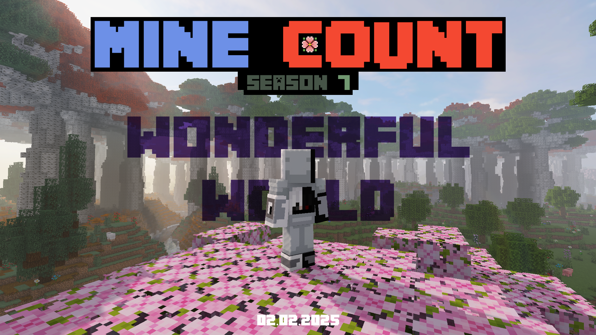

# 🌸 ┇ Сезон 7 - Wonderful World

## ⚙️ ┇ Технічні відомості

Під час сьомого сезону сервер працює на версії `1.21`.

## ⌛ ┇ Продовжуваність сезону

Дата запуску сезону: **2 лютого 2025 року**.

## ⭐ ┇ Особливий геймплей

Особливий геймплей - це спеціальне ігрове правило сервера Mine Count, що було запроваджено на початку 5-го сезону. Його сенс в повному збереженні ванільних механік та першопочаткового сенсу гри, але також додати певні геймплейні особливості, щоб покращити ігровий досвід.

Особливістю цього сезону є повністю змінена генерація ландшафту, біомів та структур, що представляють гру з нової сторони.

## 🏓 ┇ Що потрібно для гри?

Загалом можна грати за допомогою абсолютно чистого ванільного Minecraft клієнта, але наш сервер оснащено додатковим програмним забезпеченням, як наприклад [голосовий чат](/software#%EF%B8%8F--голосовий-чат), аби покращити ігровий досвід. І якщо ви виявляєте бажання ним користуватися, то вам доведеться скористатися модифікованим клієнтом зі встановленими відповідними модифікаціями, сумісні версії яких ви зможете знайти на [сторінці додаткового ПЗ](/software).

## 🎫 ┇ Як доєднатися до сервера?

Дані та детальну інструкцію з підключення до сервера можна знайти на відповідній [сторінці](/how-to-join). Якщо у вас виникають труднощі зі з'єднанням, то для вас вже підготована [сторінка](/cant-join), яка висвітлює різні помилки та методи вирішення.